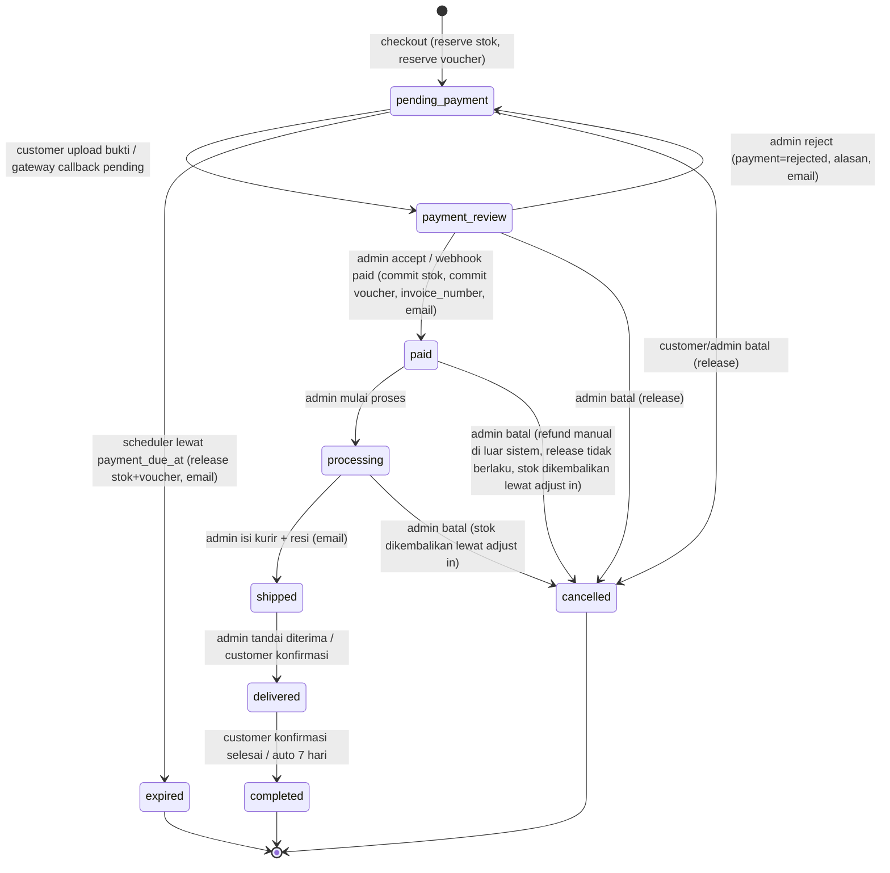
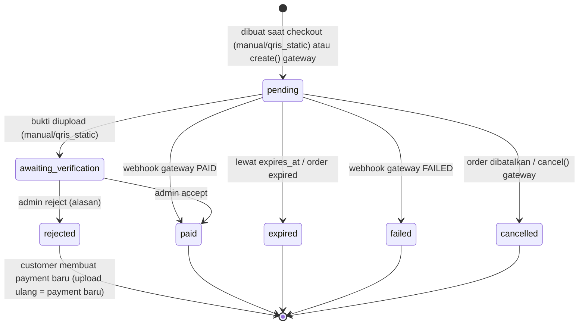
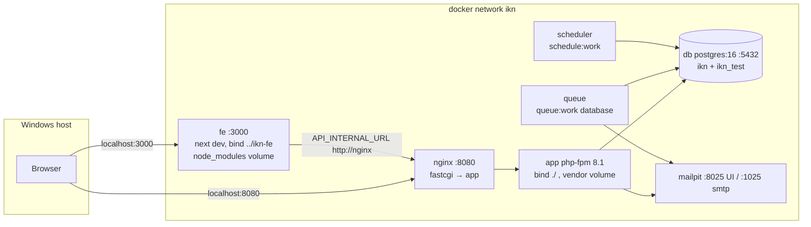
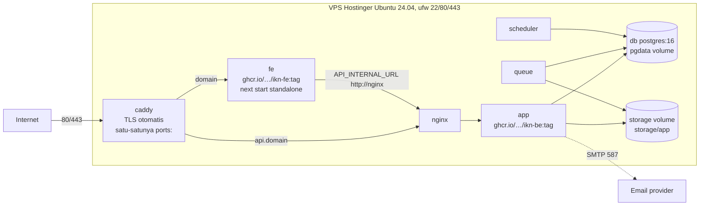

# 01 – Arsitektur Backend IKN (ikn-be)

- Tanggal: 2026-09-21
- Dasar: `plan/00-discovery.md`, `plan/00-answers.md` (keputusan terkunci)
- Status: draft untuk review, belum ada kode
- Notasi: **KEPUTUSAN** = sudah terkunci oleh pemilik proyek; **ASUMSI A-n** = default yang saya pilih karena belum dijawab, dirancang agar mudah diubah; setiap ASUMSI menyebut cara mengubahnya.

---

## 1. Gambaran sistem

```
Browser ──HTTPS──▶ caddy ──▶ fe (Next.js standalone)  ──API_INTERNAL_URL──▶ nginx ──▶ app (php-fpm, Laravel 8.83.29)
   │                 │                                                          │          ├─ queue     (php artisan queue:work)
   │                 └──api.<domain>──────────────────────────────────────────▶─┘          └─ scheduler (php artisan schedule:work)
   └──NEXT_PUBLIC_API_URL (https://api.<domain>/api/v1) langsung dari browser                     │
                                                                                                  ▼
                                                                                          db (PostgreSQL 16)
```

- **Satu sumber kebenaran:** PostgreSQL lewat Laravel. Supabase, mock store localStorage, dan mock dispatcher dihapus di Phase 11 (KEPUTUSAN).
- **API-only:** tidak ada Blade, tidak ada Filament. Panel admin adalah halaman `(admin)` di `ikn-fe` yang sudah ada.
- **Dua alamat API untuk FE:** `NEXT_PUBLIC_API_URL` (browser, build-time) dan `API_INTERNAL_URL` (fetch sisi server Next.js, `http://nginx`). Tidak pernah satu variabel untuk keduanya (KEPUTUSAN).

---

## 2. Jejak backend Laravel lama di `ikn-fe` dan penilaian pakai-ulang

| Lokasi | Jejak | Bisa dipakai ulang? |
|---|---|---|
| `next.config.mjs:7-16` | Rewrite `/api/*`, `/sanctum/*`, `/storage/*` → `API_ORIGIN` jika `USE_BACKEND=true`; komentar "Backend Laravel dinonaktifkan" | **Tidak.** Rewrite menyembunyikan origin API di balik Next.js; kita memakai `api.<domain>` terpisah dengan CORS + cookie. Dihapus di Phase 11. |
| `.env.example:10-12` | `USE_BACKEND`, `API_ORIGIN` (dikomentari) | **Tidak.** Diganti `NEXT_PUBLIC_API_URL` + `API_INTERNAL_URL`. |
| `lib/api.ts:1-5, 9-18` | Komentar "Laravel tidak digunakan"; `ApiError { status, message, errors: Record<string,string[]> }` | **Ya.** Bentuk `errors` persis format 422 Laravel. `ApiError` dan `errorMessage()` dipertahankan; hanya isi `api()` yang diganti HTTP client. |
| `components/AuthProvider/AuthProvider.tsx:3` | Komentar "sesi backend (Laravel Sanctum, cookie httpOnly)"; logout mengirim `{ scope: 'customer' \| 'admin' }` | **Ya, sebagian.** Mode cookie SPA dipilih (bagian 4). Parameter `scope` tidak diperlukan lagi karena satu sesi hanya punya satu user; diterima dan diabaikan agar FE tidak berubah. |
| `lib/mock-api.ts:158, 167` | Strip prefix `/api`; handler `GET /sanctum/csrf-cookie` → 204 | **Ya.** `/sanctum/csrf-cookie` adalah route Sanctum standar dan akan benar-benar ada. Prefix menjadi `/api/v1`. |
| `lib/mock-api.ts` (seluruh dispatcher) | Penamaan path `/auth/*`, `/customer/*`, `/admin/*`, `/catalog/*`, `/content/*` | **Ya.** Dipakai sebagai dasar kontrak `02-api-contract.md`, dengan selisih tercatat. |
| `lib/mock-data.ts:380-386`, `Navbar.tsx:74,82`, `admin/navigation/page.tsx:173,181` | Path file `/storage/*.pdf` | **Ya.** Konvensi `storage:link` Laravel dipertahankan untuk file publik: `https://api.<domain>/storage/...`. File privat (bukti bayar, lampiran WBS) tidak lewat `/storage`. |
| `app/sso/verify/route.ts` | Stub `{ success: true, verified: false }` | **Tidak.** Dihapus di Phase 11 (KEPUTUSAN). |

Kesimpulan: **penamaan path, format error 422, dan model sesi cookie Sanctum dipakai ulang.** Yang tidak dipakai ulang: rewrite proxy Next.js, respons tanpa envelope, dan nama status order/payment lama.

---

## 3. Keputusan yang diminta untuk dijelaskan

### 3.1 Sanctum: mode cookie SPA (bukan bearer token)

**Dipilih: cookie SPA.** Alasan:
1. FE (`<domain>`) dan API (`api.<domain>`) berbagi domain induk, syarat utama mode ini terpenuhi (KEPUTUSAN).
2. Sesi ada di cookie `httpOnly` + `Secure` + `SameSite=Lax`: token tidak pernah tersentuh JavaScript, sehingga XSS di FE tidak bisa mencuri kredensial. Bearer token harus disimpan di `localStorage`, tepat kelemahan yang ingin dihindari.
3. `AuthProvider` di mockup memang dirancang untuk sesi cookie (komentar dan pola `GET /auth/me` saat mount), dan `mock-api` sudah punya `/sanctum/csrf-cookie`. Perubahan FE minimal.
4. Logout dan invalidasi sesi sepenuhnya di server (hapus sesi), tidak perlu daftar token yang dicabut.
5. Semua panggilan terautentikasi berasal dari browser (halaman customer/admin adalah client component). Fetch sisi server Next.js hanya untuk data publik, jadi tidak perlu meneruskan cookie dari RSC ke API. Jika suatu saat RSC butuh data terautentikasi, cookie diteruskan lewat header `Cookie` di server fetch. Bearer token tetap tersedia lewat `personal_access_tokens` untuk kebutuhan mesin-ke-mesin (misalnya webhook internal atau integrasi ERP), tanpa mengubah alur SPA.

Konfigurasi:

| Variabel | Dev (Docker) | Produksi |
|---|---|---|
| `APP_URL` | `http://localhost:8080` | `https://api.<domain>` |
| `FRONTEND_URL` | `http://localhost:3000` | `https://<domain>` |
| `SESSION_DRIVER` | `database` | `database` |
| `SESSION_DOMAIN` | `localhost` | `.<domain>` |
| `SESSION_SECURE_COOKIE` | `false` | `true` |
| `SANCTUM_STATEFUL_DOMAINS` | `localhost:3000,localhost:8080` | `<domain>,www.<domain>` |
| CORS `allowed_origins` | `http://localhost:3000` | `https://<domain>`, `https://www.<domain>` |
| CORS `supports_credentials` | `true` | `true` |
| CORS `paths` | `api/*`, `sanctum/csrf-cookie` | sama |

Alur login FE: `GET /sanctum/csrf-cookie` → `POST /api/v1/auth/login` (header `X-XSRF-TOKEN` dari cookie `XSRF-TOKEN`, `credentials: 'include'`) → `GET /api/v1/auth/me`.

### 3.2 Peran dan izin

- `users.role` ∈ `super_admin | admin | customer` (string + konstanta di model, KEPUTUSAN).
- Admin biasa dibatasi per modul lewat `users.permissions` jsonb (array kode modul). `super_admin` = semua modul (`permissions` diabaikan). Daftar modul: `dashboard, orders, payments, products, categories, stock, customers, shipping, vouchers, fees, bank_accounts, payment_methods, cms, media, news, gallery, certificates, brochures, wbs, users, settings, reports, audit`.
- Penegakan di server lewat Policy + middleware `module:<kode>`. Endpoint `GET /admin/permissions/self` (sudah dipanggil `AdminShell`) mengembalikan daftar modul yang boleh diakses.
- **ASUMSI A-4:** tidak memakai `spatie/laravel-permission`; cukup kolom jsonb + Policy. Mengubah ke spatie nanti hanya mengganti implementasi `ModuleAccess` service dan satu migrasi.

---

## 4. Daftar ASUMSI

| ID | Asumsi (default yang dipilih) | Cara mengubah |
|---|---|---|
| A-1 | Queue dan cache driver = `database` (tidak ada Redis). Rate limiter memakai cache database. | Tambah service `redis` di compose, ganti `QUEUE_CONNECTION`/`CACHE_DRIVER`. Tidak ada perubahan kode. |
| A-2 | Dokumentasi OpenAPI ditulis tangan di `ikn-be/docs/openapi.yaml`, ditayangkan Swagger UI statis di `/docs` (dev saja). Tidak ada package. | Tambah `darkaonline/l5-swagger` (^8.4 kompatibel L8) bila ingin generate dari anotasi. |
| A-3 | Translatable = kolom jsonb `{ "id": "...", "en": "..." }`, dibaca lewat trait `HasTranslations` buatan sendiri (~60 baris). API mengembalikan objek `{id,en}` utuh. | Ganti trait dengan `spatie/laravel-translatable ^5` (kompatibel L8) tanpa mengubah skema. |
| A-4 | RBAC = `users.role` + `users.permissions` jsonb (lihat 3.2). | Ganti ke `spatie/laravel-permission ^5`. |
| A-5 | Dataset wilayah: kode Kemendagri (Kepmendagri 100.1.1-6117/2022) dari repo publik `cahyadsn/wilayah` (CSV/SQL, MIT), diimpor seeder ke satu tabel `regions(code, parent_code, level, name)`. | Ganti sumber CSV; struktur tabel tetap. |
| A-6 | Email keluar lewat SMTP relay port 587 (provider transactional, misalnya Brevo/Mailgun/Postmark; dipilih saat Phase 12). Dev memakai Mailpit. Pengirim `noreply@<domain>`. | Ganti kredensial `MAIL_*` di `.env`. |
| A-7 | Nomor order tetap `IKN-YYYYMMDD-NNNNN` (sudah dipakai FE dan seed). Nomor invoice `INV/YYYY/MM/NNNNN` diterbitkan saat status `paid`. Invoice = JSON order + nomor invoice; FE mencetak (print CSS). Tidak ada generator PDF di server. | Tambah `barryvdh/laravel-dompdf ^1.0` (kompatibel L8/PHP 8.1) dan endpoint `GET /customer/orders/{n}/invoice.pdf`. |
| A-8 | Pajak: PPN 11%, harga produk **sudah termasuk PPN**, semua produk `is_taxable=true`. Semua di `settings`. | Ubah `tax.rate`, `tax.price_includes_tax`, atau flag per produk dari panel admin. |
| A-9 | Kode unik transfer manual **aktif**, 3 digit (001–999), **ditambahkan** ke total, disimpan di `orders.unique_code`. Tidak dipakai untuk QRIS statis. | Setting `payment.unique_code_enabled=false`. |
| A-10 | Produk `price_mode=quote` tidak bisa masuk keranjang; tombol menjadi "Minta penawaran" yang membuat `contact_messages` bertipe `quote`. | Tambah modul quotation nanti; tidak ada data yang harus dimigrasi. |
| A-11 | Keranjang tetap di sisi klien (localStorage, seperti mockup). Server menyediakan `POST /cart/quote` untuk validasi harga/stok dan hitung total sebelum checkout. Tidak ada tabel `carts`. | Tambah tabel `carts` + endpoint sinkronisasi; `POST /cart/quote` tetap dipakai. |
| A-12 | Customer boleh login setelah verifikasi email meskipun belum disetujui admin; yang diblokir hanya checkout (`403 ACCOUNT_NOT_APPROVED`). Dashboard menampilkan status akun. | Ubah middleware `EnsureCustomerActive` agar juga memblokir login. |
| A-13 | Ulasan hanya untuk order `completed`, satu ulasan per produk per order, langsung tayang; admin bisa menyembunyikan. | Ubah default `reviews.is_published=false` untuk moderasi. |
| A-14 | Media library = tabel `media` + Laravel Filesystem (disk `public` untuk aset CMS, disk `private` untuk bukti bayar dan lampiran WBS). Tidak ada resize gambar di server (FE sudah `images.unoptimized`). | Tambah `intervention/image ^2.7` untuk thumbnail. |
| A-15 | Gateway referensi untuk kerangka driver: **Xendit** (QRIS dinamis, VA, e-wallet dalam satu API). Implementasi lewat Laravel HTTP client, tanpa SDK. | Tambah driver lain (Midtrans) dengan mengimplementasikan contract yang sama. |
| A-16 | Ongkir dihitung dari `products.weight_gram` (kolom baru; default 1000 g bila belum diisi) dan zona berdasarkan kode provinsi/kabupaten alamat. | Isi berat asli produk; ganti calculator ke RajaOngkir/Biteship lewat interface. |
| A-17 | Audit log = tabel `audit_logs` sendiri, diisi oleh `AuditLogger` service dari controller admin (bukan observer model), tanpa package. | Ganti ke `spatie/laravel-activitylog ^4`. |
| A-18 | Node **20 LTS** untuk image FE (`package.json` belum punya `engines`; Next 14 butuh ≥ 18.17). Field `engines` ditambahkan di Phase 11. | Ubah `engines` dan base image. |
| A-19 | Domain produksi belum ditentukan; ditulis `<domain>`. Dev memakai `localhost:3000` (FE) dan `localhost:8080` (API). | Isi `.env` dan `Caddyfile`. |
| A-20 | Backup ke object storage S3-compatible lewat `rclone` (misalnya Cloudflare R2 atau Backblaze B2). | Ganti remote rclone. |
| A-21 | WBS: laporan punya kode `WBS-YYYYMM-NNNN`, pelapor bisa anonim, lampiran privat, status `new/review/closed`, pelapor bisa cek status lewat kode tanpa login. | Tambah field/alur sesuai SOP klien. |
| A-22 | Form kontak menyimpan ke `contact_messages` dan mengirim email ke admin. | – |
| A-23 | Harga promo produk (`promo_price`, periode) hanya di level produk; promo per kategori diimplementasikan sebagai voucher otomatis (tanpa kode) dengan scope kategori. | Tambah tabel `category_promos` bila perlu. |
| A-24 | Laporan penjualan dihitung on-the-fly dari `orders` (`paid_at`, status ≥ paid, tidak cancelled/expired). Tidak ada tabel agregat. | Tambah tabel ringkasan harian bila data besar. |
| A-25 | Kebijakan password: min. 8 karakter, huruf dan angka. Rate limit login 5/menit per IP+email, register 3/menit per IP. Link verifikasi email berlaku 60 menit. | Ubah di `config/auth_policy.php`. |
| A-26 | Ulang-kirim notifikasi admin untuk order baru ke semua admin dengan modul `orders` (email), tanpa in-app notification. | Tambah kanal WhatsApp/in-app di `OrderNotifier`. |

---

## 5. Struktur kode `ikn-be`

```
ikn-be/
├─ app/
│  ├─ Http/
│  │  ├─ Controllers/Api/V1/{Auth,Account,Public,Customer,Admin,Webhook}/...
│  │  ├─ Requests/{Auth,Account,Customer,Admin}/...        # Form Request
│  │  ├─ Resources/...                                     # API Resource, camelCase
│  │  └─ Middleware/{EnsureRole, EnsureModule, EnsureCustomerActive, SetLocale}
│  ├─ Models/...                                           # konstanta status di model
│  ├─ Policies/...
│  ├─ Services/
│  │  ├─ Orders/{OrderStateMachine, OrderCalculator, OrderNumberGenerator, OrderExpirer}
│  │  ├─ Stock/{StockLedger}                               # satu-satunya penulis stock_movements
│  │  ├─ Payments/{PaymentService, Contracts/PaymentGateway, Drivers/{ManualDriver, XenditDriver}}
│  │  ├─ Shipping/{Contracts/ShippingRateCalculator, ZoneRateCalculator}
│  │  ├─ Vouchers/{VoucherService}
│  │  ├─ Cms/{PageRenderer, SectionRegistry}
│  │  ├─ Geo/{NominatimClient}
│  │  ├─ Media/{MediaService}
│  │  ├─ Auth/{RegistrationService, ModuleAccess}
│  │  └─ Audit/{AuditLogger}
│  ├─ Support/{Money, Translatable/HasTranslations, Localized}
│  ├─ Jobs/..., Mail/..., Console/Commands/{ExpireOrders, ImportRegions, BackupNotify}
│  └─ Exceptions/{ApiException, InvalidTransition, InsufficientStock, ...}
├─ config/{ikn.php (setting default), sanctum.php, cors.php}
├─ database/{migrations, seeders/{Demo*, Regions*, CmsFromSite*}, factories}
├─ docs/{openapi.yaml, supabase-schema.sql (arsip), erd.md}
├─ docker/{php/Dockerfile, php/{php.ini, www.conf, entrypoint.sh}, nginx/default.conf,
│          db/init/01-create-test-db.sql, caddy/Caddyfile, scripts/{backup.sh, restore.sh}}
├─ docker-compose.yml, docker-compose.prod.yml, .env.docker.example, .gitattributes
├─ routes/api.php (prefix v1), routes/web.php (kosong kecuali /up dan /docs dev)
└─ tests/{Feature/<modul>, Unit/{OrderCalculatorTest, StockLedgerTest, ...}}
```

Konvensi penting:
- Semua kolom waktu `timestampTz`; koneksi DB `SET TIME ZONE 'UTC'` saat connect; `APP_TIMEZONE=Asia/Jakarta`. Laravel menulis dengan offset (`Y-m-d H:i:sO`) sehingga Postgres menyimpan instan absolut (UTC). API mengeluarkan ISO-8601 dengan offset `+07:00`.
- Uang: `decimal(15,2)` di DB, `Money` helper mengeluarkan integer rupiah di JSON.
- Status: konstanta di model (`Order::STATUS_PENDING_PAYMENT`), validasi `Rule::in(Order::STATUSES)`.
- Email: mutator `strtolower(trim())`, index unique.
- Pencarian: `ILIKE` lewat scope `whereIlike`.
- Setiap perubahan stok hanya lewat `StockLedger`, setiap transisi order hanya lewat `OrderStateMachine`, setiap hitungan harga hanya lewat `OrderCalculator`.

Package (kandidat, **semua diverifikasi `composer why-not` / `composer require --dry-run` di Phase 0 terhadap Laravel 8.83.29 + PHP 8.1, lalu dipin**):

| Package | Versi kandidat | Peran | Catatan kompatibilitas |
|---|---|---|---|
| laravel/framework | `8.83.29` (exact) | inti | mendukung PHP ^7.3\|^8.0 (8.1 OK sejak 8.62) |
| laravel/sanctum | `^2.15` | auth SPA | Sanctum 3.x butuh Laravel 9, jadi tetap 2.x |
| laravel/tinker | `^2.8` | dev | |
| fruitcake/laravel-cors | `^2.2` | CORS (bawaan L8) | L9 memindahkannya ke framework; di L8 masih package |
| guzzlehttp/guzzle | `^7.8` | HTTP client (Nominatim, gateway) | bawaan L8 |
| phpunit/phpunit | `^9.6` | test | |
| nunomaduro/collision | `^5.11` | test output | |
| fakerphp/faker | `^1.23` | seeder | |
| Opsional nanti: barryvdh/laravel-dompdf `^1.0`, intervention/image `^2.7`, darkaonline/l5-swagger `^8.4` | | | semua mendukung L8 + PHP 8.1 |

Tidak ada SDK gateway (Xendit lewat HTTP client), tidak ada spatie (lihat ASUMSI A-3/A-4/A-17).

---

## 6. ERD

Kolom ditulis ringkas; semua tabel punya `id bigserial`, `created_at/updated_at timestamptz` kecuali disebut lain. Kolom `*_i18n` = jsonb `{id,en}`.

```mermaid
erDiagram
    users ||--o| customer_profiles : has
    users ||--o{ customer_addresses : has
    users ||--o{ orders : places
    users ||--o{ reviews : writes
    users ||--o{ audit_logs : acts
    regions ||--o{ regions : parent

    categories ||--o{ products : contains
    products ||--o{ product_images : has
    products ||--o{ stock_movements : ledger
    products ||--o{ reviews : receives
    products ||--o{ order_items : snapshot
    media ||--o{ product_images : file

    orders ||--|{ order_items : contains
    orders ||--o{ order_status_histories : timeline
    orders ||--o{ payments : attempts
    orders ||--o{ stock_movements : reference
    orders ||--o| voucher_usages : uses
    vouchers ||--o{ voucher_usages : tracked
    payment_methods ||--o{ payments : via
    bank_accounts ||--o{ payments : target
    media ||--o| payments : proof
    payments ||--o{ payment_webhook_logs : matched

    shipping_zones ||--o{ shipping_zone_regions : covers
    shipping_zones ||--o{ shipping_rates : offers

    pages ||--|{ page_sections : composed
    menus ||--|{ menu_items : has
    menu_items ||--o{ menu_items : children
    media ||--o{ posts : cover
    media ||--o{ banners : image
    media ||--o{ gallery_items : file
    media ||--o{ certificates : file
    media ||--o{ brochures : file
    media ||--o{ customer_logos : logo
    media ||--o{ doc_links : file
    media ||--o| wbs_reports : attachment

    users {
        bigint id PK
        string name
        string email UK "lowercase"
        string password
        string role "super_admin|admin|customer"
        string status "pending|active|rejected|inactive"
        jsonb permissions "modul admin, null=all"
        timestamptz email_verified_at
        timestamptz approved_at
        bigint approved_by FK
        text rejection_reason
        timestamptz last_login_at
        timestamptz deleted_at
    }
    customer_profiles {
        bigint user_id PK, FK
        string company
        string position
        string company_email
        string company_phone
        string tax_id
        string phone
    }
    customer_addresses {
        bigint id PK
        bigint user_id FK
        string label
        string recipient_name
        string phone
        text address_line
        string province_code FK
        string regency_code FK
        string district_code FK
        string village_code FK
        string postal_code
        decimal lat "10,7"
        decimal lng "10,7"
        text note
        bool is_default
    }
    regions {
        string code PK "Kemendagri"
        string parent_code FK
        string level "province|regency|district|village"
        string name
    }
    categories {
        bigint id PK
        string slug UK
        jsonb name_i18n
        jsonb description_i18n
        bigint image_media_id FK
        int sort_order
        bool is_active
    }
    products {
        bigint id PK
        string slug UK
        string code UK
        bigint category_id FK
        jsonb name_i18n
        string kind
        jsonb summary_i18n
        jsonb highlights_i18n
        jsonb specs "[[k,v]]"
        jsonb applications_i18n
        jsonb solubility
        jsonb aliases
        string price_mode "fixed|quote"
        decimal price "15,2"
        decimal promo_price "15,2 null"
        timestamptz promo_starts_at
        timestamptz promo_ends_at
        string unit
        int moq
        int weight_gram
        int stock_qty "cache dari ledger"
        int reserved_qty "cache dari ledger"
        string stock_status "in_stock|made_to_order|out_of_stock"
        bool is_taxable
        bool is_published
        decimal rating_avg "3,2"
        int review_count
        timestamptz deleted_at
    }
    product_images {
        bigint id PK
        bigint product_id FK
        bigint media_id FK
        int sort_order
    }
    stock_movements {
        bigint id PK
        bigint product_id FK
        string type "in|adjust|reserve|release|commit"
        int qty "signed"
        string reference_type
        bigint reference_id
        string idempotency_key UK "null ok"
        text note
        bigint created_by FK
        timestamptz created_at
    }
    reviews {
        bigint id PK
        bigint product_id FK
        bigint user_id FK
        bigint order_id FK
        smallint rating
        text body
        bool is_published
    }
    orders {
        bigint id PK
        string number UK "IKN-YYYYMMDD-NNNNN"
        string invoice_number UK "null sampai paid"
        bigint user_id FK
        string status "state machine"
        string payment_status "denormalisasi payment terakhir"
        jsonb customer_snapshot
        jsonb shipping_address_snapshot
        jsonb shipping_snapshot "rate,label,eta,weight"
        decimal subtotal "15,2"
        decimal discount_total
        decimal shipping_total
        decimal tax_total
        decimal fee_total
        int unique_code
        decimal grand_total
        bool price_includes_tax
        decimal tax_rate "5,2"
        string voucher_code
        text note
        timestamptz payment_due_at
        timestamptz paid_at
        timestamptz shipped_at
        timestamptz delivered_at
        timestamptz completed_at
        timestamptz cancelled_at
        timestamptz expired_at
        text cancel_reason
        string courier
        string tracking_number
    }
    order_items {
        bigint id PK
        bigint order_id FK
        bigint product_id FK
        jsonb product_snapshot "slug,code,name,unit,image"
        int qty
        decimal unit_price
        decimal discount_amount
        decimal tax_amount
        decimal line_total
        int weight_gram
    }
    order_status_histories {
        bigint id PK
        bigint order_id FK
        string from_status
        string to_status
        text note
        string actor_type "user|system|webhook"
        bigint actor_id
        jsonb meta "courier,tracking,reason"
        timestamptz created_at
    }
    payment_methods {
        bigint id PK
        string code UK
        string type "manual_transfer|qris_static|qris_dynamic|virtual_account|ewallet"
        string driver "manual|xendit"
        jsonb name_i18n
        jsonb instructions_i18n
        jsonb config "qris image media id, fee, dll"
        bool is_active
        int sort_order
    }
    bank_accounts {
        bigint id PK
        string bank_name
        string account_number
        string account_holder
        bool is_active
        int sort_order
    }
    payments {
        bigint id PK
        bigint order_id FK
        bigint payment_method_id FK
        string method "code"
        string provider "manual|xendit"
        string external_id "UK per provider"
        decimal amount "15,2"
        string status "pending|awaiting_verification|paid|rejected|expired|failed|cancelled"
        timestamptz expires_at
        timestamptz paid_at
        jsonb payload "raw gateway / instruksi"
        bigint bank_account_id FK
        bigint proof_media_id FK "disk private"
        timestamptz proof_uploaded_at
        bigint verified_by FK
        timestamptz verified_at
        text reject_reason
    }
    payment_webhook_logs {
        bigint id PK
        string provider
        string event
        string external_id
        bool signature_valid
        jsonb headers
        jsonb payload
        string result "processed|duplicate|ignored|error"
        bigint payment_id FK
        timestamptz created_at
    }
    shipping_zones {
        bigint id PK
        jsonb name_i18n
        bool is_active
        int priority
    }
    shipping_zone_regions {
        bigint id PK
        bigint zone_id FK
        string region_code FK
        string level
    }
    shipping_rates {
        bigint id PK
        bigint zone_id FK
        jsonb name_i18n
        string type "flat|per_kg"
        decimal base_amount
        decimal per_kg_amount
        decimal min_amount
        decimal free_above "null=tidak ada"
        jsonb eta_i18n
        bool is_active
        int sort_order
    }
    fees {
        bigint id PK
        jsonb name_i18n
        string type "admin|other"
        decimal amount
        bool is_active
    }
    vouchers {
        bigint id PK
        string code UK
        string type "percent|fixed"
        decimal value
        decimal min_subtotal
        decimal max_discount
        int quota
        int used_count
        int per_user_limit
        jsonb scope "all|category ids"
        timestamptz starts_at
        timestamptz ends_at
        bool is_active
    }
    voucher_usages {
        bigint id PK
        bigint voucher_id FK
        bigint user_id FK
        bigint order_id FK
        string status "reserved|committed|released"
    }
    settings {
        string key PK
        jsonb value
        string group
        bool is_public
    }
    media {
        bigint id PK
        string disk "public|private"
        string path
        string original_name
        string mime
        bigint size
        string collection
        jsonb meta
        bigint uploaded_by FK
    }
    pages {
        bigint id PK
        string slug UK
        jsonb title_i18n
        string status "draft|published"
        jsonb seo
        string template
    }
    page_sections {
        bigint id PK
        bigint page_id FK
        string type "registry"
        int sort_order
        jsonb content "translatable di dalam"
        bool is_visible
    }
    menus {
        bigint id PK
        string location UK "header|footer"
    }
    menu_items {
        bigint id PK
        bigint menu_id FK
        bigint parent_id FK
        jsonb label_i18n
        string url
        jsonb description_i18n
        int sort_order
        bool is_active
    }
    posts {
        bigint id PK
        string slug UK
        jsonb title_i18n
        jsonb excerpt_i18n
        jsonb body_i18n
        string tag
        bigint cover_media_id FK
        bool is_published
        timestamptz published_at
    }
    banners {
        bigint id PK
        jsonb title_i18n
        jsonb subtitle_i18n
        bigint media_id FK
        string link
        int sort_order
        bool is_active
    }
    faqs {
        bigint id PK
        jsonb question_i18n
        jsonb answer_i18n
        int sort_order
        bool is_active
    }
    gallery_items {
        bigint id PK
        jsonb title_i18n
        string type "image|video"
        bigint media_id FK
        string external_url
        bool is_published
        int sort_order
    }
    certificates {
        bigint id PK
        jsonb name_i18n
        jsonb material_i18n
        jsonb description_i18n
        bigint media_id FK
        bool is_published
        int sort_order
    }
    brochures {
        bigint id PK
        jsonb title_i18n
        bigint media_id FK
        bool is_published
        int sort_order
    }
    customer_logos {
        bigint id PK
        string name
        bigint media_id FK
        int sort_order
        bool is_active
    }
    doc_links {
        bigint id PK
        string category
        jsonb label_i18n
        bigint media_id FK
        string url
        int sort_order
        bool is_active
    }
    wbs_reports {
        bigint id PK
        string code UK
        string subject
        text body
        string reporter_name
        string reporter_contact
        bool is_anonymous
        bigint attachment_media_id FK
        string status "new|review|closed"
        bigint handled_by FK
        text admin_notes
    }
    contact_messages {
        bigint id PK
        string type "contact|quote"
        string name
        string email
        string phone
        string subject
        text message
        jsonb meta
        timestamptz read_at
    }
    audit_logs {
        bigint id PK
        bigint user_id FK
        string action
        string subject_type
        bigint subject_id
        jsonb before
        jsonb after
        string ip
        string user_agent
        timestamptz created_at
    }
```



Tabel bawaan Laravel/Sanctum: `sessions`, `personal_access_tokens`, `password_resets`, `jobs`, `failed_jobs`, `cache`.

Pemetaan dari 13 tabel Supabase (referensi, bukan salinan): `categories`/`products`/`reviews` → dinormalisasi + i18n; `orders` → `orders` + `order_items` + `order_status_histories` + `payments`; `customer_profiles` + `customers` → `users` + `customer_profiles` + `customer_addresses`; `commerce_config` (satu JSON) → `bank_accounts`, `shipping_zones/rates`, `fees`, `settings`; `news` → `posts`; `gallery`/`certificates`/`brochures` → tabel sendiri + `media`; `admin_users` → `users` (role admin); `wbs_reports` → diperluas.

---

## 7. State machine

### 7.1 Order



Catatan: `packing` di mockup dihapus (KEPUTUSAN: state machine baru). `payment_review` **tidak** di-expire otomatis. Transisi `delivered → completed` otomatis setelah 7 hari (ASUMSI, setting `order.auto_complete_days`).

Tabel transisi dan efek samping (semua lewat `OrderStateMachine::transition($order, $to, $actor, $meta)`):

| Dari → Ke | Pemicu | Efek samping |
|---|---|---|
| ∅ → pending_payment | `CheckoutService` | reserve stok, reserve voucher, `payment_due_at = now + payment_due_hours`, email + notifikasi admin |
| pending_payment → payment_review | `POST /customer/orders/{n}/proof` atau webhook | payment `awaiting_verification`, email admin |
| payment_review → paid | admin accept / webhook | commit stok, commit voucher, `paid_at`, `invoice_number`, email customer |
| payment_review → pending_payment | admin reject | payment `rejected` + alasan; batas waktu tidak berubah; email customer |
| pending_payment → expired | `orders:expire` tiap menit | release stok (idempoten), release voucher, payment `expired`, email customer |
| pending_payment/payment_review → cancelled | customer (hanya pending_payment) / admin | release stok, release voucher, payment `cancelled` |
| paid/processing → cancelled | admin | `adjust in` stok (bukan release, karena sudah commit), catatan refund manual |
| paid → processing → shipped → delivered → completed | admin / customer / scheduler | histori + email pada `shipped` dan `delivered` |

Invarian: `orders.payment_status` selalu = status payment terbaru; setiap transisi menulis satu baris `order_status_histories`; transisi tidak valid melempar `InvalidTransition` (HTTP 409 `INVALID_TRANSITION`).

### 7.2 Payment (per percobaan bayar)



Aturan:
- Satu order boleh punya banyak `payments`; hanya satu yang `pending`/`awaiting_verification` pada satu waktu.
- Upload ulang setelah ditolak membuat baris `payments` baru (histori penolakan tersimpan).
- `expires_at` payment = `orders.payment_due_at` untuk metode manual; untuk gateway mengikuti respons gateway.
- Webhook: `external_id` + `provider` unik; event yang sama dua kali → `payment_webhook_logs.result = duplicate`, tanpa efek samping.

---

## 8. Alur reservasi stok

Aturan ledger (`StockLedger`, satu-satunya penulis `stock_movements`):

| type | qty | efek ke `products` | idempotency_key |
|---|---|---|---|
| `in` | +n | `stock_qty += n` | opsional |
| `adjust` | ±n | `stock_qty += n` | opsional |
| `reserve` | +n | `reserved_qty += n` | `order:{id}:reserve:{product_id}` |
| `release` | −n | `reserved_qty -= n` | `order:{id}:release:{product_id}` |
| `commit` | −n | `reserved_qty -= n`, `stock_qty -= n` | `order:{id}:commit:{product_id}` |

`available = stock_qty - reserved_qty`. Kolom cache di `products` selalu dihitung ulang dari ledger oleh perintah `stock:rebuild` (dipakai test dan pemulihan).

```mermaid
sequenceDiagram
    participant C as Customer
    participant API as CheckoutController
    participant Calc as OrderCalculator
    participant DB as PostgreSQL
    participant L as StockLedger
    participant SM as OrderStateMachine

    C->>API: POST /customer/orders {items, addressId, shippingRateId, paymentMethod, voucherCode}
    API->>DB: BEGIN
    API->>DB: SELECT * FROM products WHERE id IN (...) ORDER BY id FOR UPDATE
    Note over API,DB: urutan id tetap = tidak deadlock antar checkout paralel
    API->>API: cek is_published, price_mode=fixed, moq, available >= qty
    alt stok kurang
        API->>DB: ROLLBACK
        API-->>C: 409 INSUFFICIENT_STOCK {productSlug, available}
    end
    API->>Calc: hitung subtotal, promo, voucher, ongkir, pajak, fee, kode unik
    API->>DB: INSERT orders (snapshot) + order_items
    API->>L: reserve(product, qty, order) x N
    L->>DB: INSERT stock_movements(type=reserve, idempotency_key) ; UPDATE products SET reserved_qty = reserved_qty + qty
    API->>DB: INSERT voucher_usages(status=reserved) ; UPDATE vouchers SET used_count+1 (jika ada)
    API->>DB: INSERT payments(status=pending, amount=grand_total)
    API->>SM: transition(∅ → pending_payment)
    API->>DB: COMMIT
    API-->>C: 201 {order}
    API-)API: dispatch OrderPlaced (email customer, email admin)
```

Idempotensi release/commit: `INSERT ... ON CONFLICT (idempotency_key) DO NOTHING` lalu `UPDATE products` **hanya jika** baris ledger benar-benar terinsert (cek `rowCount`). Menjalankan `release` dua kali untuk order yang sama tidak mengubah stok. Test wajib: dua request checkout paralel untuk stok 1 (hanya satu berhasil), `release` dipanggil dua kali (stok kembali tepat sekali).

---

## 9. OrderCalculator (urutan hitung)

1. `unit_price` = `promo_price` jika promo aktif, selain itu `price` (snapshot ke `order_items`).
2. `subtotal = Σ unit_price × qty` (validasi `moq`).
3. Diskon voucher: cek periode, kuota, `per_user_limit`, `min_subtotal`, scope; `discount = min(percent×subtotal atau fixed, max_discount)`. Dialokasikan proporsional ke item (`discount_amount`) untuk laporan.
4. Ongkir: `ShippingRateCalculator::quote(address, items)` → zona dari `village→district→regency→province` (yang paling spesifik menang), `weight = Σ weight_gram×qty`, `amount = max(min_amount, base + per_kg×ceil(kg))`, `0` jika `subtotal-discount ≥ free_above`.
5. Fee aktif (misalnya biaya admin) → `fee_total`.
6. Pajak: jika `price_includes_tax` → `tax_total = round((subtotal-discount) × rate/(1+rate))` (informasi, tidak menambah total); jika eksklusif → ditambahkan. Hanya item `is_taxable`.
7. `unique_code` (jika aktif dan metode manual_transfer) → 1–999, unik di antara order `pending_payment` hari yang sama.
8. `grand_total = subtotal − discount + shipping + fee + (tax jika eksklusif) + unique_code`.

Semua pembulatan ke rupiah bulat (`round half up`). Unit test menutupi tiap langkah dan kombinasi (inklusif/eksklusif, voucher persen dengan cap, gratis ongkir).

---

## 10. Docker

### 10.1 Dev (`ikn-be/docker-compose.yml`)



| Service | Image | Port host | Volume | Catatan |
|---|---|---|---|---|
| app | build `docker/php/Dockerfile` target `dev` | – | `./:/var/www/html` bind, `vendor:/var/www/html/vendor` named | user `www` (uid 1000), xdebug off default |
| queue | image sama | – | sama | `php artisan queue:work --tries=3 --timeout=90` |
| scheduler | image sama | – | sama | `php artisan schedule:work` |
| nginx | `nginx:1.27-alpine` | 8080 | `docker/nginx/default.conf`, `./public` bind | `client_max_body_size 20m` |
| db | `postgres:16` | 5432 | `pgdata` named, `docker/db/init` | init membuat `ikn_test`; healthcheck `pg_isready` |
| mailpit | `axllent/mailpit` | 8025, 1025 | – | dev saja |
| fe | build `../ikn-fe/Dockerfile` target `dev` | 3000 | `../ikn-fe:/app` bind, `fe_node_modules` named | `NEXT_PUBLIC_API_URL=http://localhost:8080/api/v1`, `API_INTERNAL_URL=http://nginx/api/v1` |

### 10.2 Produksi (`ikn-be/docker-compose.prod.yml`)



| Service | Image | `ports:` | Limit memori (4 GB) | Catatan |
|---|---|---|---|---|
| caddy | `caddy:2` | 80, 443 | 128M | `Caddyfile`: `<domain> → fe:3000`, `api.<domain> → nginx:80`; volume `caddy_data` (sertifikat) |
| fe | `ghcr.io/<org>/ikn-fe:<tag>` | – | 512M | `NEXT_PUBLIC_API_URL` di-bake saat build (build arg); `API_INTERNAL_URL=http://nginx/api/v1` runtime |
| nginx | `nginx:1.27-alpine` | – | 64M | `public/` disalin ke image nginx dari image app (multi-stage) atau volume read-only |
| app | `ghcr.io/<org>/ikn-be:<tag>` | – | 768M | php-fpm `pm=dynamic`, `pm.max_children=12` (≈ 768M / 60M), opcache on, `validate_timestamps=0` |
| queue | image sama | – | 256M | `queue:work --tries=3 --max-time=3600` |
| scheduler | image sama | – | 128M | `schedule:work` |
| db | `postgres:16` | – | 1G | `shared_buffers=256MB`, `effective_cache_size=768MB`, `max_connections=50`; healthcheck; `depends_on: condition: service_healthy` di app/queue/scheduler |

Semua service `restart: unless-stopped`. Tidak ada `ports:` selain caddy (KEPUTUSAN: port publish Docker menembus ufw). Untuk RAM 8 GB, limit app 1.5G dan `max_children=24`, db 2G / `shared_buffers=512MB`.

### 10.3 Image dan entrypoint

`docker/php/Dockerfile` (multi-stage):
1. `composer` stage dari `php:8.1-cli` + binary composer (bukan image `composer:2`, KEPUTUSAN): `composer install --no-dev --optimize-autoloader` (prod) / dengan dev (target dev).
2. `runtime` dari `php:8.1-fpm`: ekstensi `pdo_pgsql pgsql mbstring bcmath intl gd zip exif pcntl opcache`; user `www` non-root; `php.ini` (memory 256M, upload 20M, opcache); `www.conf` (`pm.max_children` dari env `PHP_PM_MAX_CHILDREN`); `entrypoint.sh` (LF, `.gitattributes`: `*.sh text eol=lf`).

`entrypoint.sh`: tunggu `pg_isready` (maks 60 s) → `php artisan storage:link` (idempoten) → jika `APP_ENV=production`: `config:cache`, `route:cache`, `event:cache` → jika `RUN_MIGRATIONS=true`: `migrate --force` → exec perintah service (php-fpm / queue / scheduler).

`ikn-fe/Dockerfile` (Phase 12): `node:20-alpine` (ASUMSI A-18) multi-stage `deps → build (ARG NEXT_PUBLIC_API_URL) → runner` dengan `output: 'standalone'`, user `nextjs`, `HOSTNAME=0.0.0.0`.

### 10.4 Volume, backup, restore

- Volume: `pgdata` (Postgres), `storage` (`storage/app`, termasuk `private/`), `caddy_data`.
- `docker/scripts/backup.sh`: `pg_dump -Fc` via `docker compose exec -T db` + `tar` volume storage → `/var/backups/ikn/YYYYMMDD/` → `rclone copy` ke remote (ASUMSI A-20) → prune lokal 3 hari, remote 7 harian + 4 mingguan.
- `docker/scripts/restore.sh <tanggal>`: stop app/queue/scheduler → `pg_restore --clean` ke db → ekstrak storage → start. Prosedur uji restore triwulanan masuk runbook.
- Cron host: `0 2 * * * /opt/ikn/backup.sh` (02:00 WIB = 19:00 UTC; host timezone diset Asia/Jakarta).

### 10.5 CI/CD

- GitHub Actions di `ikn-be`: test (Postgres service) → build image → push `ghcr.io/<org>/ikn-be:{sha,latest}`.
- GitHub Actions di `ikn-fe`: typecheck + build image dengan build arg `NEXT_PUBLIC_API_URL` → push `ghcr.io/<org>/ikn-fe`.
- Deploy: SSH ke VPS sebagai user `deploy`, `cd /opt/ikn && docker compose -f docker-compose.prod.yml pull && up -d`, lalu `docker image prune -f`. Rollback = pin tag sebelumnya di `.env` (`IKN_BE_TAG`, `IKN_FE_TAG`) dan `up -d`.
- Fallback build di server (RAM terbatas): aktifkan swap 2 GB, `docker compose build fe` dengan `NODE_OPTIONS=--max-old-space-size=1536`; didokumentasikan tapi bukan jalur utama.

---

## 11. CMS dan i18n

### 11.1 Tipe section (registry, mengikuti section yang ada di mockup)

| type | Dipakai halaman | Konten jsonb (ringkas) |
|---|---|---|
| `hero_slider` | home | slides[] {title_i18n, subtitle_i18n, media_id, cta[]} |
| `marquee` | home | items[] {text_i18n} |
| `stats` | home | items[] {value, label_i18n} |
| `capabilities` | home | items[] {icon, title_i18n, desc_i18n} |
| `product_highlights` | home | product_ids[] |
| `video_gallery` | home, galeri | gallery_item_ids[] atau auto |
| `rich_text` | umum | body_i18n |
| `timeline` | tentang (history) | items[] {year, title_i18n, desc_i18n} |
| `vision_mission` | tentang | vision_i18n, missions_i18n[] |
| `values_akhlak` | tentang | items[] {code, title_i18n, desc_i18n} |
| `contact_locations` | kontak | locations[] {name_i18n, address, phone, email, lat, lng} |
| `sustainability_pillars` | keberlanjutan | items[] |
| `reach_compliance` | keberlanjutan/reach | body_i18n, doc_link_id |
| `customer_logos` | keberlanjutan/pelanggan | auto dari tabel |
| `cta` | umum | title_i18n, button {label_i18n, url} |
| `faq` | umum | faq_ids[] atau auto |

Admin hanya mengubah isi, urutan (`sort_order`), dan `is_visible`; tipe section dan tampilannya tetap milik FE. Seed awal dari `lib/site.ts` (KEPUTUSAN). Halaman publik History, Visi-Misi, Kontak, dan Logo Pelanggan membaca `GET /content/pages/{slug}` (KEPUTUSAN).

Kompatibilitas: endpoint lama `GET/PUT /admin/blocks/{history|vision-mission|contact}` dipertahankan sebagai alias yang membaca/menulis section terkait, agar halaman admin mockup tetap berjalan sampai diganti editor section.

### 11.2 Bahasa

- Header `Accept-Language: id|en` (default `id`) menentukan bahasa pesan validasi/error dan field yang "diresolusi" (misalnya subjek email).
- Field konten dikembalikan sebagai objek `{id, en}` (ASUMSI A-3), fallback `en → id` dilakukan di server saat menyusun objek sehingga `en` tidak pernah kosong.
- Validasi dua bahasa: `resources/lang/{id,en}/validation.php` + atribut nama field.

---

## 12. Keamanan ringkas

- Semua endpoint admin di belakang `auth:sanctum` + `role:admin|super_admin` + `module:<kode>`; endpoint customer di belakang `auth:sanctum` + `role:customer`; checkout tambahan `customer.active`.
- Bukti bayar dan lampiran WBS di disk `private` (`storage/app/private`), diakses hanya lewat `GET /files/{media}` dengan Policy (pemilik order atau admin), respons `X-Accel-Redirect` internal nginx.
- Rate limit: auth 5/menit, register 3/menit, `POST /wbs` dan `POST /contact` 5/jam per IP, Nominatim proxy 60/menit per IP dan 1 req/detik global ke upstream.
- Upload: whitelist mime (`image/jpeg,png,webp,pdf`), maks 5 MB bukti bayar, 20 MB dokumen; nama file diacak; `finfo` untuk deteksi mime asli.
- Webhook gateway: verifikasi token/signature per provider, idempoten, payload mentah ke `payment_webhook_logs`, tidak pernah mempercayai `amount` dari webhook tanpa mencocokkan `payments.amount`.
- Audit log untuk semua aksi tulis admin (sebelum/sesudah).
- Header keamanan dan HSTS di caddy; CORS ketat; `APP_DEBUG=false`; `.env` tidak di image.
